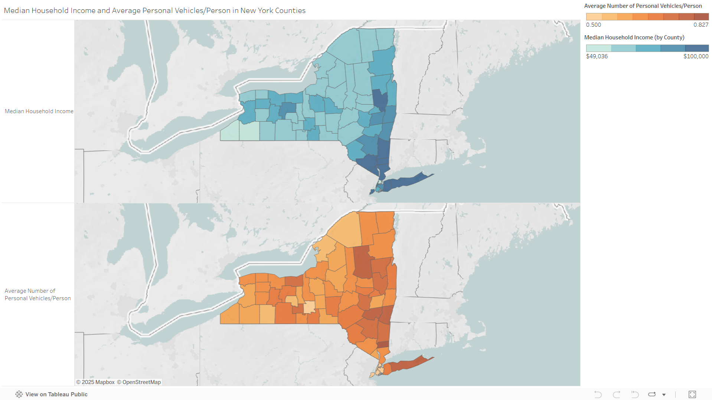

# Geospatial Analysis of Vehicles and Median Income with Choropleth Maps in Tableau

## Objective

Although I did not find a linear correlation between vehicles per capita and median household income in the main analysis, I thought it was likely that various socioeconomic and geographic features would contributed to the observed differences. To better visualize how and where that might occur, I created choropleth maps of each variable.

## Methods

Using Tableau, I visualized the average number of vehicles/capita and median household income by county. To do this, I exported the "reg_pers" dataframe, created in Cell 10 of the main notebook, to a .csv file and imported it, along with the county_stats csv file. These two tables were joined based on county name. I also captured the "Vehicle per Capita" column created in Cell 14 by creating a measure (COUNTD[VIN]/SUM[Total Population]). 

Note that the Average Number of Personal Vehicles/Person legend is set to a fixed minimum of 0.500 and the Median Household Income Legend is set to a fixed maximum of 100,000 in order to adequately visualize the range of values despite significant outliers. So, all counties with the first measure less than 0.500 are the same color and likewise for all counties with the second measure greater than 100,000. 

## Analysis and Discussion

Although I did not find a linear correlation between these two measures in the main notebook, a geographic visualization revealed some interesting trends. For example, some of the least populous counties, such as Hamilton and Schuyler, have an average number of vehicles/person similar to much more populous counties such as Suffolk. One possible reason for this could be that in less populated rural counties, there may be more households with a pickup truck in addition to a smaller passenger vehicle to support agricultural, environmental, and recreational (i.e. campgrounds) work. 

Although such things are only speculative, viewing the counties side-by-side on a map invites us to explore the social, economic, and geographic differences between New York's counties that lead to these differences and distinctions

***Click the image to view the live dashboard on Tableau Public***

