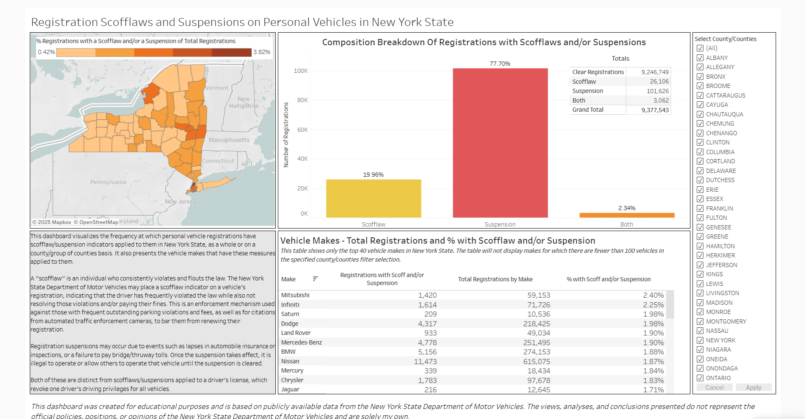

# Scoffing the Law: New York State Enforcement Measures Applied to Vehicle Registrations

Author: Daniel Weinstein

Date: April 27th, 2025

## Objectives
Personal vehicles are essential for both work and leisure, especially when public transportation is not readily available. However, vehicles also impose significant costs, in both purchase and upkeep, on their owners, and this burden is felt more for households/families in lower socioeconomic brackets. Using a combination of New York State Department of Motor Vehicles (DMV) vehicle registration data and demographic/economic data from the U.S. Census Bureau, this project seeks to explore trends in vehicle ownership as well as relationships between vehicles and socioeconomic indicators across geographic locations in New York State. This may reveal trends that guide further research and analysis directions about the state of vehicles in New York.

## Data Source 
The main source for this analysis is the "Vehicle, Snowmobile, and Boat Registrations" dataset, available through New York Open Data (https://data.ny.gov/Transportation/Vehicle-Snowmobile-and-Boat-Registrations/w4pv-hbkt/about_data). The New York State Department of Motor Vehicle (DMV) requires registration of personal and commercial cars, trucks, boats, snowmobiles, and so on. The registration ties with other important aspects of vehicle ownership, such as insurance coverage and vehicle inspection status, to provide a regulatory mechanism to ensure the suitability of a vehicle for the road and to tie it to a particular owner in a particular state.

This dashboard was created using the "reg_pers" dataframe from my other project "Income Driven: Exploring Relationships Between Vehicles and Household Income in New York State. The steps for cleaning/filtering this data can be found in this [notebook](https://github.com/DSWeins676/Data-Analysis-Portfolio/blob/main/IncomeDriven/Income_Driven.ipynb). In brief, I selected only registrations that were not boats, snowmobiles, or trailers. Based on registration classes, I created separate dataframes for commercial vehicles, personal vehicles, and motorcycles. This dataframe was exported to a .csv file to be used in Tableau.

## Methods

All manipulation beyond the creation of the reg_pers .csv was performed in Tableau. Some key points of this methodology include:

### **Exclude revocations**

To avoid the ambiguity of a revoked registration (for example, does a registration marked with both a suspension and revocation still count as a suspension?), records with Revocation Indicator = "Y" were filtered at the contextual level in Tableau. As there were only 48 such records in the reg_pers dataset, this should have minimal impacts on the results.

&nbsp;
&nbsp;
   
### **New York State Choropleth Map**

This map shows the percentage, of all registration, that contain a suspension, a scofflaw, or both. I created the calculated fields "Scofflaw_IndNum," "Susp_IndNum" in the data source to convert the original suspension/scofflaw indicators, which contained "Y" or "N" to "1" or "0," respectively. To avoid double-counting those registrations containing both,I created a new calculated field "Both_SuspScoff_IndNum" to indicate those registrations that contained both (Susp_IndNum + Scofflaw_IndNum = 1 + 1 = 2, in which case Both_SuspScoff_IndNum = 1, else 0). The coloring on the map was determined by the formula below:

```
(SUM([Scofflaw_IndNum])+SUM([Susp_IndNum])-SUM([Both_SuspScoff_IndNum]))/COUNTD([VIN])
```

The scale for the map's colors has been fixed on both ends, encompassing the lowest and highest % values, so that the colors for each county remain constant irrespective of any counties excluded by the filer.

&nbsp;
&nbsp;

### **Composition Breakdown of Registrations Bar Chart**

I created a bar chart to display the number of registrations, represented by COUNTD[VIN], that contained a scofflaw, a suspension, both, or neither (a clear registration). To do this, I created the following calculated field named "SuspScoff Category":

```
IF [Suspension Indicator] = 'Y' AND [Scofflaw Indicator] = 'Y' THEN 'Suspension and Scofflaw'
ELSEIF [Suspension Indicator] = 'N' AND [Scofflaw Indicator] = 'Y' THEN 'Scofflaw'
ELSEIF [Suspension Indicator] = 'Y' AND [Scofflaw Indicator] = 'N' THEN 'Suspension'
ELSE 
    'Clear Registration'
END
```
Because there were substantially more clear registrations, I excluded this from the bar chart by filtering the new calculated field. The y-axis is the total count of each category, but I also added a text indicator, using a percent of total table calculation, to indicate the percentage each category of non-clear registrations made of the total of non-clear registrations.

&nbsp;
&nbsp;

### **Suspensions/Scofflaws by Vehicle Make**

I also included a table displaying the number of registrations with a scofflaw and/or suspension compared to the total by vehicle make. As there were over 2,000 unique values in the "Make" column, some of which include duplicates with minor spelling differences (i.e. TOYOTA versus TOYOT), only the top 40 makes, by COUNTD[VIN], were included in the table. Further, I added a filter for COUNTD[VIN] >= 100 to try to account for distortions that could occur when calculating percentages due to very small sample sizes. This was an important feature for if a user chooses to filter the dashboard by a single county, where there could sometimes be less than 10 of one of the Top 40 makes in New York, three of which had a suspension, giving an inflated, albeit technically accurate, 30% scoff/suspension rate for that vehicle make in that county.

A complete table of all makes can be found in the Tableau public workbook, but is not displayed on the dashboard. I've only cleaned the aliases for the Top 40 makes, so all others present in that table will be as they were in the original dataset.

&nbsp;
&nbsp;

### **Filter by County**

Finally, the dashboard allows the user to view data for New York state (all counties), one particular county, or any combination of any number of counties. All worksheets comprising the dashboard have this county filter applied, and so will simultaneously update with the user's choice. 

&nbsp;
&nbsp;

***Click the image to view the live dashboard on Tableau Public***

[](https://public.tableau.com/views/NYRegistrationScofflaws/NYRegistrationScoffsSuspensions?:language=en-US&:sid=&:redirect=auth&:display_count=n&:origin=viz_share_link)
